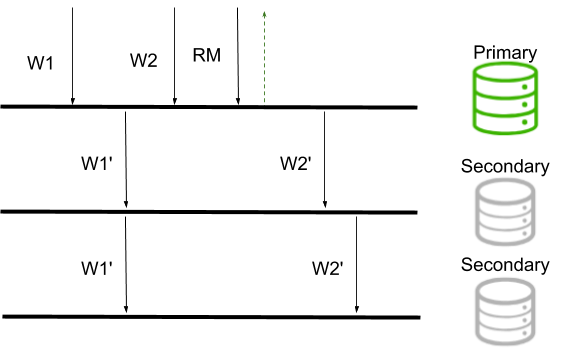
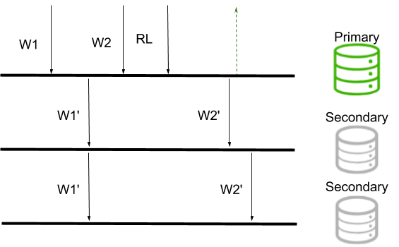

# Chapter 2: Replication

## 2.1 What is Replication?

### Quiz

Which of the following are true about binary replication and statement-based replication?

- [x] Statement-based replication is platform independent.
- [ ] Binary replication is more accurate than statement-based replication.
- [x] MongoDB uses statement-based replication, not binary replication.

***See detailed answer***

__Correct answers:__

- __Statement-based replication is platform independent.__

Statement-based replication is agnostic of operating system, because statements do not depend on a specific byte makeup or instruction set.

- __MongoDB uses statement-based replication, not binary replication.__

MongoDB uses a small variation of statement-based replication which reduces statements to idempotent versions so they can be repeated.

__Incorrect answer:__

- __Binary replication is more accurate than statement-based replication.__

Both methods of replication are accurate; however they do vary in speed and variability across operating systems.

## 2.2 MongoDB Replica Set

### Quiz

Which of the following are true for replica sets in MongoDB?

- [ ] Replica set members have a fixed role assigned.
- [x] Replica sets provide high availability.
- [ ] We should always use arbiters.
- [ ] We can have up to 50 voting members in a replica set.

***See detailed answer***

__Correct answer:__

- __Replica sets provide high availability.__

Replica sets use failover to provide high availability to client applications.

__Incorrect answers:__

- __We can have up to 50 voting members in a replica set.__

We can have up to 50 replica set members, but only 7 of those will be voting members.

- __Replica set members have a fixed role assigned.__

Replica sets ensure high availability. This implies that if a given node fails, regardless of its role, the availability of the system will be ensured by failing over the role of primary to an available secondary node through an election.

- __We should always use arbiters.__

Arbiters should not be used lightly and their utilization in the set is highly discouraged.

## 2.2 Setting Up a Replica Set

### Lecture Instructions

The configuration file for the first node (node1.conf):

        storage:
            dbPath: /var/mongodb/db/node1
        net:
            bindIp: 192.168.103.100,localhost
            port: 27011
        security:
            authorization: enabled
            keyFile: /var/mongodb/pki/m103-keyfile
        systemLog:
            destination: file
            path: /var/mongodb/db/node1/mongod.log
            logAppend: true
        processManagement:
            fork: true
        replication:
            replSetName: m103-example

Creating the keyfile and setting permissions on it:

        sudo mkdir -p /var/mongodb/pki/
        sudo chown vagrant:vagrant /var/mongodb/pki/
        openssl rand -base64 741 > /var/mongodb/pki/m103-keyfile
        chmod 400 /var/mongodb/pki/m103-keyfile

Creating the dbpath for node1:

        mkdir -p /var/mongodb/db/node1

Starting a mongod with node1.conf:

        mongod -f node1.conf

Copying node1.conf to node2.conf and node3.conf:

        cp node1.conf node2.conf
        cp node2.conf node3.conf

Editing node2.conf using vi:

        vi node2.conf

Saving the file and exiting vi:

        :wq

node2.conf, after changing the dbpath, port, and logpath:

        storage:
            dbPath: /var/mongodb/db/node2
        net:
            bindIp: 192.168.103.100,localhost
            port: 27012
        security:
            keyFile: /var/mongodb/pki/m103-keyfile
        systemLog:
            destination: file
            path: /var/mongodb/db/node2/mongod.log
            logAppend: true
        processManagement:
            fork: true
        replication:
            replSetName: m103-example

node3.conf, after changing the dbpath, port, and logpath:

        storage:
            dbPath: /var/mongodb/db/node3
        net:
            bindIp: 192.168.103.100,localhost
            port: 27013
        security:
            keyFile: /var/mongodb/pki/m103-keyfile
        systemLog:
            destination: file
            path: /var/mongodb/db/node3/mongod.log
            logAppend: true
        processManagement:
            fork: true
        replication:
            replSetName: m103-example

Creating the data directories for node2 and node3:

        mkdir /var/mongodb/db/{node2,node3}

Starting mongod processes with node2.conf and node3.conf:

        mongod -f node2.conf
        mongod -f node3.conf

Connecting to node1:

        mongo --port 27011

Initiating the replica set:

        rs.initiate()

Creating a user:

        use admin
        db.createUser({
            user: "m103-admin",
            pwd: "m103-pass",
            roles: [
                {role: "root", db: "admin"}
            ]
        })

Exiting out of the Mongo shell and connecting to the entire replica set:

        exit
        mongo --host "m103-example/192.168.103.100:27011" -u "m103-admin"
        -p "m103-pass" --authenticationDatabase "admin"

Getting replica set status:

        rs.status()

Adding other members to replica set:

        rs.add("m103.mongodb.university:27012")
        rs.add("m103.mongodb.university:27013")

Getting an overview of the replica set topology:

        rs.isMaster()

Stepping down the current primary:

        rs.stepDown()

Checking replica set overview after election:

        rs.isMaster()

### Quiz

Which of the following is/are true about setting up a replica set?

- [ ] All nodes in a replica set must be run on the same port.
- [x]  Enabling internal authentication in a replica set implicitly enables client authentication.
- [ ] rs.initiate() must be run on every node in the replica set.
- [x] When connecting to a replica set, the mongo shell will redirect the connection to the primary node.

***See detailed answer***

__Correct answers:__

- __Enabling internal authentication in a replica set implicitly enables client authentication.__

This is true; if nodes authenticate to each other, clients must authenticate to the cluster.

- __When connecting to a replica set, the mongo shell will redirect the connection to the primary node.__

This is true; even if an election is held and there is temporarily no primary, the shell will wait to connect until a primary is elected.

__Incorrect answers:__

- __All nodes in a replica set must be run on the same port.__

This is incorrect; in fact, the nodes should be run on different ports. Ideally, they would each run on different machines.

- __rs.initiate() must be run on every node in the replica set.__

This is incorrect; rs.initiate() should only be run on one node in the replica set.

## Lab - Initiate a Replica Set Locally

### Problem

In this lab you will launch a replica set with three members from within your Vagrant environment. To secure this replica set, you will create a keyfile for your nodes to use when communicating with each other.

For this lab, you must place this keyfile in the /var/mongodb/pki directory and change the permissions so only the owner of the file can read it or write to it:

        sudo mkdir -p /var/mongodb/pki
        sudo chown vagrant:vagrant -R /var/mongodb
        openssl rand -base64 741 > /var/mongodb/pki/m103-keyfile
        chmod 600 /var/mongodb/pki/m103-keyfile

Your three mongod processes will each have their own configuration file, and now those config files can reference the keyfile you just made. These config files will be similar to the config file from the previous lab, but with the following adjustments:

| type  | PRIMARY  | SECONDARY  | SECONDARY  |
| -- | -- | -- | -- |
| config filename | mongod-repl-1.conf | mongod-repl-2.conf | mongod-1repl-3.conf
| port | 27001 | 27002 | 27003 |
| dbPath | /var/mongodb/db/1 | /var/mongodb/db/2 | /var/mongodb/db/3 |
| logPath | /var/mongodb/db/mongod1.log | /var/mongodb/db/mongod2.log | /var/mongodb/db/mongod3.log |
| replSet | m103-repl | m103-repl | m103-repl |
| keyFile | /var/mongodb/pki/m103-keyfile | /var/mongodb/pki/| m103-keyfile | /var/mongodb/pki/m103-keyfile |
bindIP | localhost,192.168.103.100 | localhost,192.168.103.100 | localhost,192.168.103.100 |

Note that the mongod does not automatically create the dbPath directory. You will need to create this yourself:

        mkdir /var/mongodb/db/{1,2,3}

Once your configuration files are complete, you can start up the replica set:

1. Start a mongod process with the first config file (on port 27001). This mongod process will act as the primary node in your replica set (at least, until an election occurs).

2. Now use the mongo shell to connect to this node. On this node, and only this node, initiate your replica set with rs.initiate(). Remember that this will only work if you are connected from localhost.

3. Once you run rs.initiate(), the node automatically configures a default replication configuration and elects itself as a primary. Use rs.status() to check the status of the replica set. The shell prompt will read PRIMARY once the initiation process completes successfully.

4. Because the replica set uses a keyfile for internal authentication, clients must authenticate before performing any actions.

While still connected to the primary node, create an admin user for your cluster using the localhost exception. As a reminder, here are the requirements for this user:

      - Role: root on admin database
      - Username: m103-admin
      - Password: m103-pass

5. Now exit the mongo shell and start the other two mongod processes with their respective configuration files.

6. Reconnect to your primary node as m103-admin and add the other two nodes to your replica set. Remember to use the IP address of the Vagrant box 192.168.103.100 when adding these nodes.

7. Once your other two members have been successfully added, run rs.status() to check that the members array has three nodes - one labeled PRIMARY and two labeled SECONDARY.

Now run the validation script in your vagrant and outside the mongo shell and enter the validation key you receive below. If you receive an error, it should give you some idea of what went wrong.

        vagrant@m103:~$ validate_lab_initialize_local_replica_set

Solution:

        5a4d32f979235b109001c7bc

***See detailed answer***

Below is an example of a valid config file for the first node in our replica set:

        storage:
            dbPath: /var/mongodb/db/1
        net:
            bindIp: 192.168.103.100,localhost
            port: 27001
        security:
            keyFile: /var/mongodb/pki/m103-keyfile
        systemLog:
            destination: file
            path: /var/mongodb/db/mongod1.log
            logAppend: true
        processManagement:
            fork: true
        operationProfiling:
            slowOpThresholdMs: 50
        replication:
            replSetName: m103-repl

Once we are connected to this first node, we can initiate our replica set with rs.initiate(). Again, this command must be run from the same host as the mongod to use the localhost exception.

We can create our m103-admin user with the following commands:

        rs.initiate()
        use admin
        db.createUser({
            user: "m103-admin",
            pwd: "m103-pass",
            roles: [
                {role: "root", db: "admin"}
            ]
        })

After exiting the mongo shell, we can start up the other two mongod processes. These will be the secondary nodes in our replica set.

Now that the cluster has a configured user for authentication, we cannot use the localhost exception anymore. Instead, connect using the mongo shell and specify the m103-admin user to authenticate and connect to the cluster. As this user, we can add our other two nodes with the following commands:

        rs.add("192.168.103.100:27002")
        rs.add("192.168.103.100:27003")

We should receive a response that says {"ok" : 1} from each of these rs.add() commands. Now, running rs.status() should give us a members list with three healthy nodes.

## 2.3 Replication Configuration Document

### Quiz

Which of the following fields are included in the replica set configuration document?

- [x] _id
- [ ] writeConcern
- [x] settings
- [x] members
- [ ] hosts

***See detailed answer***

__Correct answers:__

- __settings__

This is a document that contains configuration options that apply to the whole replica set.

- __members__

This is an array of member configuration documents, one for each member of the replica set.

- ___id__

This is the name of the replica set. Once set, you cannot change the name of a replica set.

__Incorrect answers:__

- __hosts__

This is not a real field; the hostname of each replica set member can be found in members[n].host.

- __writeConcern__

This is not a real field; the default writeConcern for a replica set can be changed in settings.getLastErrorDefaults. You can find more information in the docs.

## 2.4 Replication Command

### Lecture Instructions

Commands covered in this lesson:

        rs.status()
        rs.isMaster()
        db.serverStatus()['repl']
        rs.printReplicationInfo()

### Quiz

What information can be obtained from running rs.printReplicationInfo()?

- [ ] The current primary in the replica set.
- [ ] The last statement entered in the oplog.
- [x] The time of the earliest entry in the oplog.
- [ ] The earliest statement entered in the oplog.
- [x] The time of the latest entry in the oplog.

***See detailed answer***

__Correct answers:__

- __The time of the earliest entry in the oplog.__

- __The time of the latest entry in the oplog.__

rs.printReplicationInfo() gives us the times of the earliest and latest entries in the oplog.

__Incorrect answers:__

- __The earliest statement entered in the oplog.__

- __The last statement entered in the oplog.__

rs.printReplicationInfo() will only return timestamps for oplog statements; the statements themselves can be found in local.oplog.rs.

- __The current primary in the replica set.__

rs.printReplicationInfo() only contains information pertaining to the node where the command was run.

## 2.5 Local DB

### Lecture Instructions Part 1

Making a data directory and launching a mongod process for a standalone node:

        mkdir allbymyselfdb
        mongod --dbpath allbymyselfdb

All MongoDB instances start with two default databases, admin and local:

        mongo
        show dbs

Display collections from the local database (this displays more collections from a replica set than from a standalone node):

        use local
        show collections

Querying the oplog after connected to a replica set:

        use local
        db.oplog.rs.find()

Getting information about the oplog. Remember the oplog is a capped collection, meaning it can grow to a pre-configured size before it starts to overwrite the oldest entries with newer ones. The below will determine whether a collection is capped, what the size is, and what the max size is.

Storing oplog stats as a variable called stats:

        var stats = db.oplog.rs.stats()

Verifying that this collection is capped (it will grow to a pre-configured size before it starts to overwrite the oldest entries with newer ones):

        stats.capped

Getting current size of the oplog:

        stats.size

Getting size limit of the oplog:

        stats.maxSize

Getting current oplog data (including first and last event times, and configured oplog size):

        rs.printReplicationInfo()

### Lecture Instructions Part 2

Create new namespace m103.messages:

        use m103
        db.createCollection('messages')

Query the oplog, filtering out the heartbeats ("periodic noop") and only returning the latest entry:

        use local
        db.oplog.rs.find( { "o.msg": { $ne: "periodic noop" } } ).sort( { $natural: -1 } ).limit(1).pretty()

Inserting 100 different documents:

        use m103
        for ( i=0; i< 100; i++) { db.messages.insert( { 'msg': 'not yet', _id: i } ) }
        db.messages.count()

Querying the oplog to find all operations related to m103.messages:

        use local
        db.oplog.rs.find({"ns": "m103.messages"}).sort({$natural: -1})

Illustrating that one update statement may generate many entries in the oplog:

        use m103
        db.messages.updateMany( {}, { $set: { author: 'norberto' } } )
        use local
        db.oplog.rs.find( { "ns": "m103.messages" } ).sort( { $natural: -1 } )

Remember, even though you can write data to the local db, you should not.

### Quiz

Which of the following is true?

- [ ] We should drop the oplog.rs collection from time to time to avoid it becoming too big.
- [ ] The local database does not allow the creation of other collections.
- [x] The local database will not be replicated.
- [x] The oplog.rs collection contains all operations that will be replicated.
- [ ] You cannot write to the local database.

***See detailed answer***

__Correct answers:__

- __The local database will not be replicated.__

Any data written to this database will not be replicated across the different nodes of the set.

- __The oplog.rs collection contains all operations that will be replicated.__

The oplog.rs collection holds all the statements that get replicated across the different replica set members.

__Incorrect answers:__

- __You cannot write to the local database.__

Given the correct permissions, an authorized user can write data to the local db. That said, we strongly advise against that.

- __The local database does not allow the creation of other collections.__

Although we discourage it, you can write new collections to the local database.

- __We should drop the oplog.rs collection from time to time to avoid it becoming too big.__

We cap the oplog.rs collection instead of dropping it entirely.

## 2.6 Reconfiguring a Running Replica Set

### Lecture Instructions

node4.conf:

        storage:
            dbPath: /var/mongodb/db/node4
        net:
            bindIp: 192.168.103.100,localhost
            port: 27014
        systemLog:
            destination: file
            path: /var/mongodb/db/node4/mongod.log
            logAppend: true
        processManagement:
            fork: true
        replication:
            replSetName: m103-example

arbiter.conf:

        storage:
            dbPath: /var/mongodb/db/arbiter
        net:
            bindIp: 192.168.103.100,localhost
            port: 28000
        systemLog:
            destination: file
            path: /var/mongodb/db/arbiter/mongod.log
            logAppend: true
        processManagement:
            fork: true
        replication:
            replSetName: m103-example

Starting up mongod processes for our fourth node and arbiter:

        mongod -f node4.conf
        mongod -f arbiter.conf

From the Mongo shell of the replica set, adding the new secondary and the new arbiter:

        rs.add("m103.mongodb.university:27014")
        rs.addArb("m103.mongodb.university:28000")

Checking replica set makeup after adding two new nodes:

        rs.isMaster()

Removing the arbiter from our replica set:

        rs.remove("m103.mongodb.university:28000")

Assigning the current configuration to a shell variable we can edit, in order to reconfigure the replica set:

        cfg = rs.conf()

Editing our new variable cfg to change topology - specifically, by modifying cfg.members:

        cfg.members[3].votes = 0
        cfg.members[3].hidden = true
        cfg.members[3].priority = 0

Updating our replica set to use the new configuration cfg:

        rs.reconfig(cfg)

### Quiz

What is true about hidden nodes?

- [ ] Secondary nodes cannot become hidden nodes without going offline.
- [ ] Hidden nodes are a type of arbiter.
- [ ] Hidden nodes can become primary.
- [x] Hidden nodes replicate data.
- [x] Hidden nodes vote in elections.

***See detailed answer***

__Correct answers:__

- __Hidden nodes vote in elections.__

Hidden nodes can never become the primary, but they can still vote in elections.

- __Hidden nodes replicate data.__

Hidden nodes replicate data from the primary, although they are invisible to client applications.

__Incorrect answers:__

- __Hidden nodes can become primary.__

Hidden nodes must have priority 0.

- __Hidden nodes are a type of arbiter.__

Hidden nodes and arbiters are different types of replica set members; arbiters hold no data while hidden nodes replicate from the oplog.

- __Secondary nodes must be restarted before converting to hidden nodes.__

Secondary nodes can be converted to hidden nodes while the replica set is running, using rs.reconfig().

## Lab - Remove and Re-Add a Node

## 2.7 Reads and Writes on a Replica Set

### Lecture Instructions

Connecting to the replica set:

        mongo --host "m103-example/m103.mongodb.university:27011" -u "m103-admin" -p
        "m103-pass" --authenticationDatabase "admin"

Checking replica set topology:

        rs.isMaster()

Inserting one document into a new collection:

        use newDB
        db.new_collection.insert( { "student": "Matt Javaly", "grade": "A+" } )

Connecting directly to a secondary node (this node may not be a secondary in your replica set!):

        mongo --host "m103.mongodb.university:27012" -u "m103-admin" -p "m103-pass"
        --authenticationDatabase "admin"

Attempting to execute a read command on a secondary node (this should fail):

        show dbs

Enabling read commands on a secondary node:

        rs.slaveOk()

Reading from a secondary node:

        use newDB
        db.new_collection.find()

Attempting to write data directly to a secondary node (this should fail, because we cannot write data directly to a secondary):

        db.new_collection.insert( { "student": "Norberto Leite", "grade": "B+" } )

Shutting down the server (on both secondary nodes)

        use admin
        db.shutdownServer()

Connecting directly to the last healthy node in our set:

        mongo --host "m103.mongodb.university:27011" -u "m103-admin" -p "m103-pass"
        --authenticationDatabase "admin"

Verifying that the last node stepped down to become a secondary when a majority of nodes in the set were not available:

        rs.isMaster()

### Quiz

Which of the following is true about reading and writing from secondaries?

- [ ] Connecting to the replica set will automatically connect to a secondary node.
- [x] We have to run rs.slaveOk() before we can read from secondary nodes.
- [ ] Running rs.slaveOk() allows us to read and write from secondaries.

***See detailed answer***

__Correct answers:__

- __We have to run rs.slaveOk() before we can read from secondary nodes.__

Reads should typically go through the primary node, but rs.slaveOk() allows us to read from secondaries.

__Incorrect answers:__

- __Connecting to the replica set will automatically connect to a secondary node.__

This is incorrect; By default, MongoDB will always redirect a Replica Set connection to the primary node. In case of Read Preference being defined in the connection string, that determines other behavior, then the connection might be redirected to connect to a Secondary node, only for read workload. Writes are always sent to the Primary node of the Replica Set cluster.

- __Running rs.slaveOk() allows us to read and write from secondaries.__

This is incorrect; rs.slaveOk only determines that the mongo shell can be set to read data if connected to a Secondary node.

### Problem

In this lab, you will make your replica set more flexible. In the previous lab, we've configured the replica set cluster using the exact IP address. However, if we configured the server with a different IP address (e.g. going from a fixed IP to DNS server for IP address resolution), this would break the replication mechanism since the nodes won't be able to reach each other with the original IP address.

In this lab, you will modify the replica set so one of the nodes uses the hostname m103, the virtual machine hostname, instead of the external IP address of the Vagrant box.

To correctly reconfigure this node, you will have to remove the node from the replica set, and then add it back with the correct hostname. For this lab, you only need to do this for one of the nodes in the set.

Some tips that will help the validator pass:

- The configuration of the nodes should not change - the hostname m103 is already bound to the IP address 192.168.103.100
- The nodes should still run on ports 27001, 27002, 27003
- The name of your replica set should still be m103-repl

When you're finished, run the validation script in your vagrant and outside the mongo shell and enter the validation key you receive below. If you receive an error, it should give you some idea of what went wrong.

        vagrant@m103:~$ validate_lab_remove_readd_node

Solution:

        5a4fff19c0324e9feb9f60b9

***See detailed answer***

We don't have to change the config files of our mongod instances, because the current bind_ip resolves the IP address of m103 hostname.

To remove a node from the replica set, simply use rs.remove():

        rs.remove("192.168.103.100:27003")

Once the node is removed, we can just add him back again, using the hostname instead: m103:

        rs.add("m103:27003")

Below is a snippet of the output from running rs.status():

        "members" : [
            {
                "_id" : 8,
                "name" : "m103:27003",
                "health" : 1,
                "state" : 2,
                "stateStr" : "SECONDARY",
            }
        ]

Notice that the name of this replica set member now says "m103:27003".

## 2.8 Failover and Elections

### Lecture Instructions

Storing replica set configuration as a variable cfg:

        cfg = rs.conf()

Setting the priority of a node to 0, so it cannot become primary (making the node "passive"):

        cfg.members[2].priority = 0

Updating our replica set to use the new configuration cfg:

        rs.reconfig(cfg)

Checking the new topology of our set:

        rs.isMaster()

Forcing an election in this replica set (although in this case, we rigged the election so only one node could become primary):

        rs.stepDown()

Checking the topology of our set after the election:

        rs.isMaster()

### Quiz

Which of the following is true about elections?

- [ ] Elections can take place anytime while the primary is available.
- [x] Nodes with priority 0 cannot be elected primary.
- [ ] All nodes have an equal chance to become primary.
- [x] Nodes with higher priority are more likely to be elected primary.

***See detailed answer***

__Correct answers:__

- __Nodes with priority 0 cannot be elected primary.__

Setting a node's priority to 0 guarantees that node will never become primary.

- __Nodes with higher priority are more likely to be elected primary.__

Raising a node's priority doesn't guarantee that node will be elected primary, but it does increase the likelihood.

__Incorrect answers:__

- __Elections can take place anytime while the primary is available.__

If a majority of nodes are unavailable, elections cannot take place.

- __All nodes have an equal chance to become primary.__

Priority and recency of a node's oplog dictates which nodes are more likely to become primary.

## 2.9 Write Concerns

### Quiz

Consider a 3-member replica set, where one secondary is offline. Which of the following write concern levels can still return successfully?

- [ ] 3
- [x] majority
- [ ] online
- [ ] all

***See detailed answer***

Majority is the correct answer. "all" and "online" are not valid write concerns. "3" would block indefinitely if one out of three members was offline.

## Lab - Writes with Failovers

### Problem

In this lab, you will attempt to write data with a writeConcern to a replica set where one node has failed.

In order to simulate a node failure within your replica set, you will connect to the node individually and shut it down. Connecting back to the replica set and running rs.status() should show the failing node with a description like this:

        {
        "name" : "m103:27001",
        "health" : 0,
        "stateStr" : "(not reachable/healthy)",
        "lastHeartbeatMessage" : "Connection refused",
        "configVersion" : -1
        }

With one of your nodes down, attempt to insert a document in your replica set by running the following commands:

        use testDatabase
        db.new_data.insert({"m103": "very fun"}, { writeConcern: { w: 3, wtimeout: 1000 }})

This will attempt to insert one record into a collection called testDatabase.new_data, while verifying that 3 nodes registered the write. It should return an error, because only 2 nodes are healthy.

Given the output of the insert command, and your knowledge of writeConcern, check all that apply:

- [ ] The write operation will always return with an error, even if wtimeout is not specified.
- [x] When a writeConcernError occurs, the document is still written to the healthy nodes.
- [ ] w: "majority" would also cause this write operation to return with an error.
- [x] The unhealthy node will be receiving the inserted document when it is brought back online.

***See detailed answer***

__Correct:__

- __When a writeConcernError occurs, the document is still written to the healthy nodes.__

The WriteResult object simply tells us whether the writeConcern was successful or not - it will not undo successful writes from any of the nodes.

- __The unhealthy node will have the inserted document when it is brought back online.__

When the unhealthy node comes back online, it rejoins the replica set and its oplog is compared with the other nodes' oplogs. Any missing operations will be replayed on the newly healthy node.

__Incorrect:__

- __w: "majority" would also cause this write operation to return with an error.__

w: "majority" requests acknowledgement that a majority of nodes in a replica set have registered the write. In a three-node replica set, only two nodes are required for a majority, so the two healthy nodes are sufficient to satisfy this writeConcern.

- __The write operation will always return with an error, even if wtimeout is not specified.__

If wtimeout is not specified, the write operation will be retried for an indefinite amount of time until the writeConcern is successful. If the writeConcern is impossible, like in this example, it may never return anything to the client.

## 2.9 Read Concerns

### Quiz

Which of the following read concerns only return data from write operations that have been committed to a majority of nodes?

- [x] linearizable
- [ ] local
- [x] majority
- [ ] available

***See detailed answer***

None of the read concerns require you to specify a write concern. However, reads with the read concern majority and linearizable will only return data that has been replicated to a majority of nodes in the replica set.

The difference between majority and linearizable lies in sense of causal consistency that linearizable enforces.

Let us look into this in detail:

When reading from a replica set with readConcern majority all documents that have been majority committed by the replica set will be returned to the application.

In the following diagram we have a set of operations taking place:

- W1 : first write operation
- W2 : second write operation
- RM : read with read concern majority.

RM will return every document, matching the query selector, that has been majority committed, by the time the server receives the RM. In this case, W1 would be returned.

---

Read concern linearizable will wait for all prior writes to be replicated to a majority of nodes before it returns a response.

In the following diagram we have:

- W1 : first write operation
- W2 : second write operation
- RL : read with read concern linearizable

The response for the read operation will wait until all writes, received by the server prior to RL, are majority committed before returning the document to the client. In this case, both W1 and W2 would be available to be returned to the client.

## 2.10 Read Preferences

### Quiz

Which of the following read preference options may result in stale data?

- [x] nearest
- [x] secondaryPreferred
- [ ] primary
- [x] secondary
- [x] primaryPreferred
  
***See detailed answer***

When using the default read preference primary, data will always be read from the primary node, and will therefore be the most recent copy.

When using any other read preference, data may be read from a secondary node, which could result in reading slightly stale data.

## Lab - Read Concern and Read Preferences

### Problem

In this lab, you will take advantage of different read preferences to increase the availability of your replica set.

To begin, load the dataset in your Vagrant box into your replica set:

        mongoimport --drop \
        --host m103-repl/192.168.103.100:27002,192.168.103.100:27001,192.168.103.100:27003 \
        -u "m103-admin" -p "m103-pass" --authenticationDatabase "admin" \
        --db applicationData --collection products /dataset/products.json

You can check that you've loaded the entire dataset by verifying that there are exactly 516784 documents in the applicationData.products collection:

        use applicationData
        db.products.count()

Once the dataset is fully imported into your replica set, you will simulate a node failure. This is similar to the previous lab, but this time you will shut down two nodes.

When two of your nodes are unresponsive, you will not be able to connect to the replica set. You will have to connect to the third node, which should be the only healthy node in the cluster.

Which of these readPreferences will allow you to read data from this node?

- [x] nearest
- [x] secondaryPreferred
- [ ] primary
- [x] secondary
- [x] primaryPreferred

***See detailed answer***

The key concept to understand here is that when two nodes go down in a three-node replica set, the third node becomes a secondary regardless of whether it started as a primary.

Therefore, connecting to the third node is the same as connecting to a secondary node, and any readPreference will work except for primary, which requires all operations to read from the primary node.

# Lectures

- [Simple Raft Protocol](http://thesecretlivesofdata.com/raft/)
- [Raft Consensus Algorithm](https://raft.github.io/)