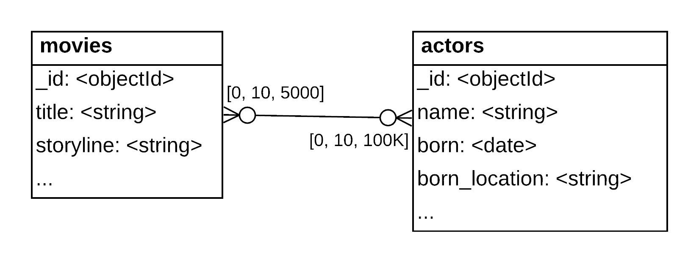
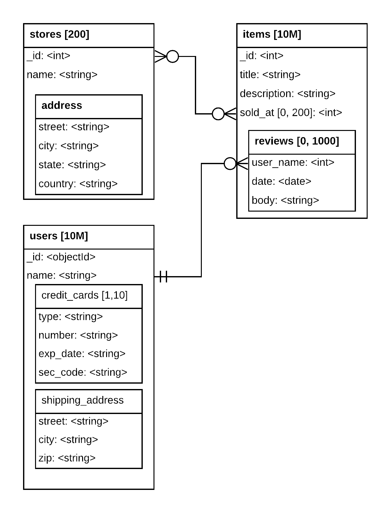
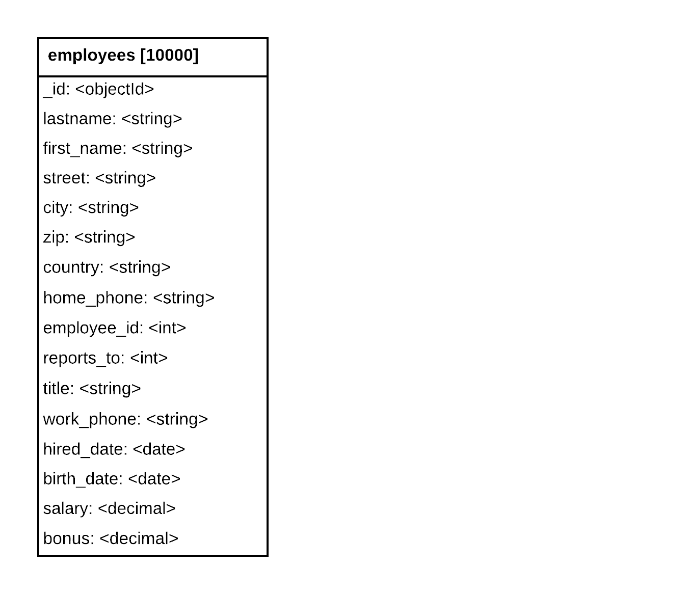
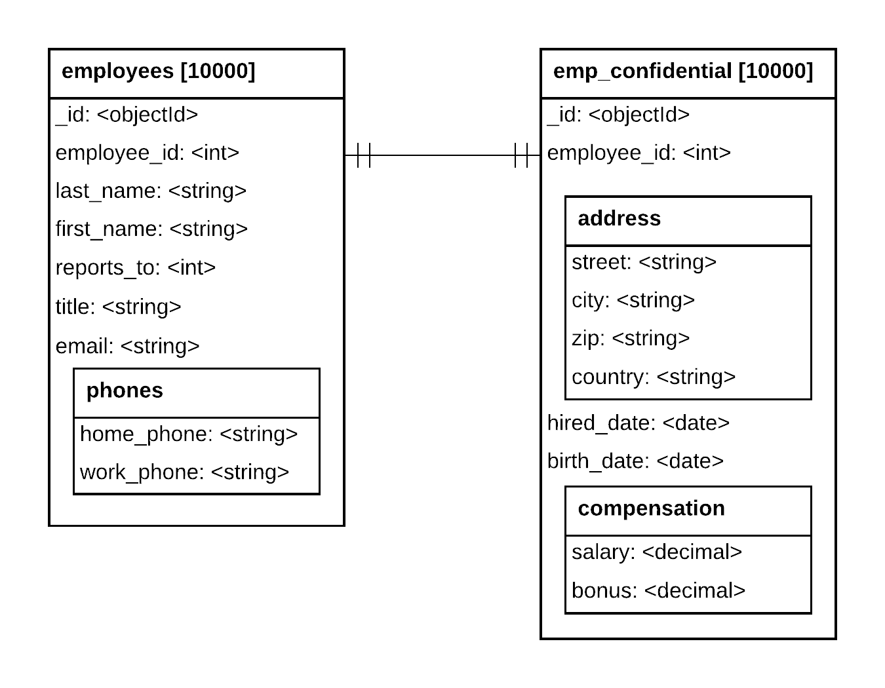
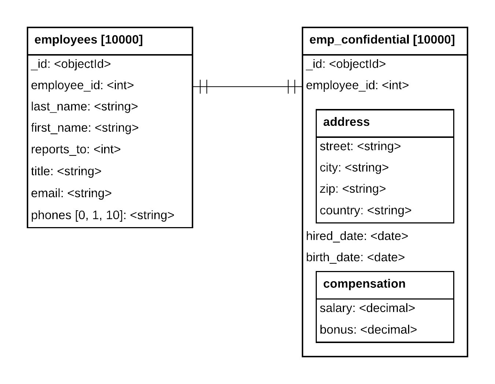
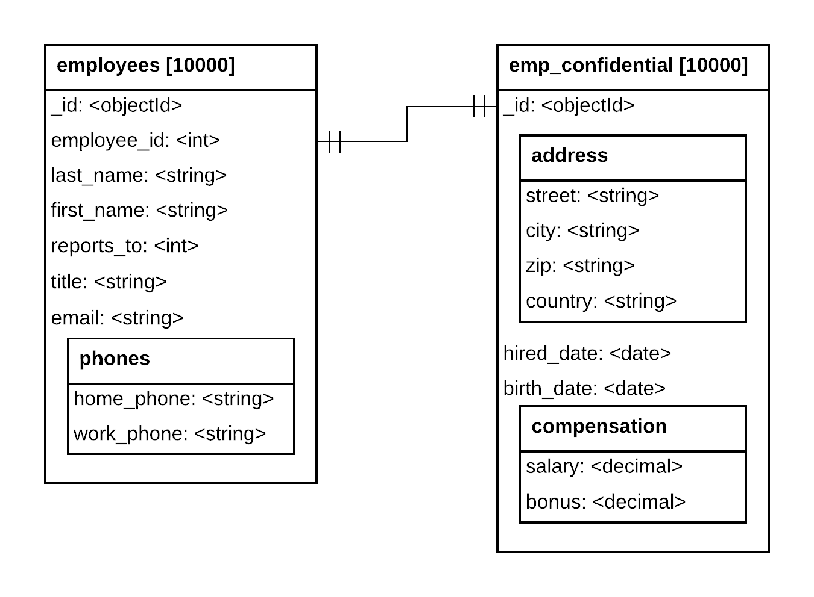
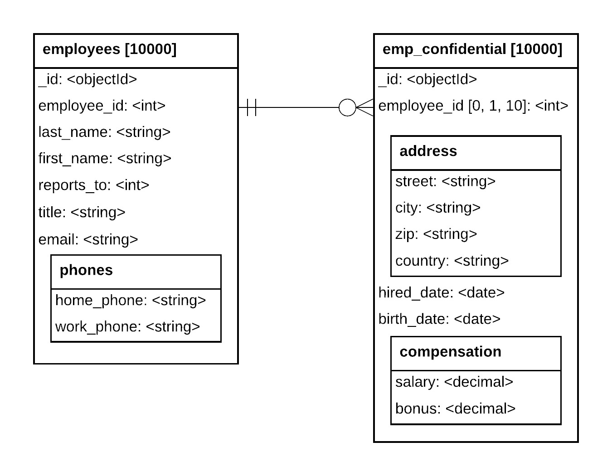
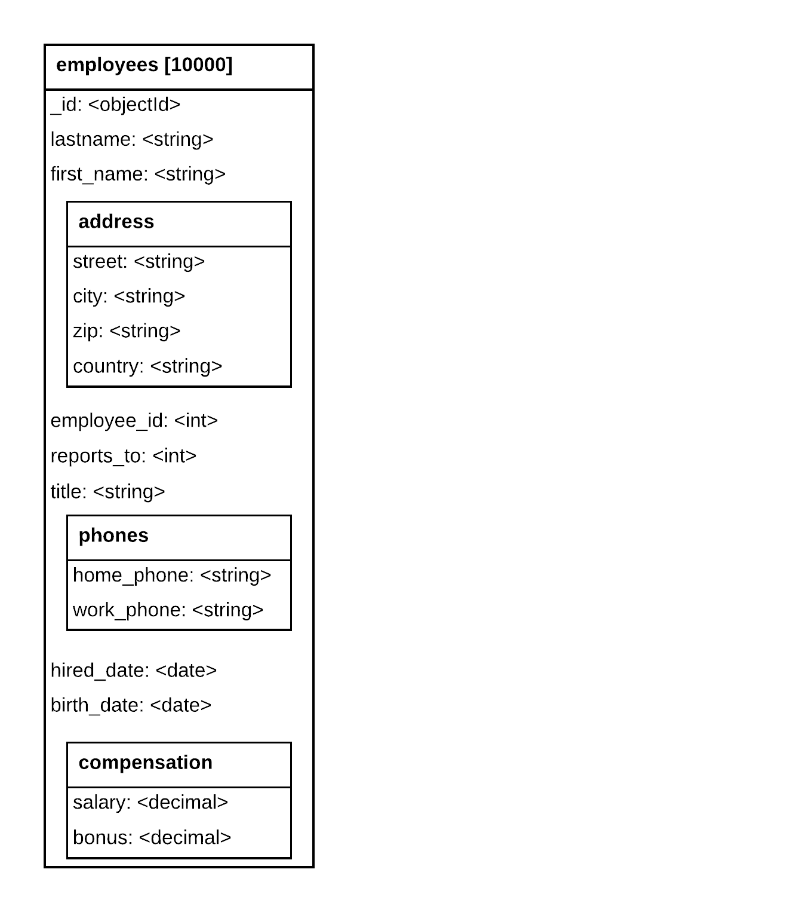

# Chapter 2: Relationships

## 2.1 Relationship Types and Cardinality

### Quiz

Why did we introduce the one-to-zillions relationship in our modeling notation?

- [x] To highlight the fact that huge cardinalities may impact design choices.
- [x] To address the fact that the concept of relationship linked to a huge number of entitites is missing in normal crow's foot notation.
- [ ] To address the fact that a crow's foot has 5 fingers, not 3.

***See detailed answer***

Correct Options:

- To highlight the fact that huge cardinalities may impact design choices.

- To address the fact that the concept of relationship linked to a huge number of entitites is missing in normal crow's foot notation.

If you know that you are traversing a huge relationship, you may want to represent it differently or be more careful about how you write queries when handling the zillions side of this side of the relationship. Large numbers were rarely a consideration in the past, however, they became a serious consideration when dealing with big data. Because there is no graphical notation in the crow's foot notation for this kind of a relationship, we added one.

Incorrect Options:

- To address the fact that a crow's foot has 5 fingers, not 3.

A crow has 4 fingers per foot.

## 2.2 One-to-Many Relationship

### Quiz

Consider a one-to-many relationship observed between a county and the cities in that county.

Which of the following are valid ways to represent this one-to-many relationship with the document model in MongoDB?

- [x] Have a collection for the counties and a collection for the cities with each city document having a field to reference the document of its county.
- [x] Embed all the fields for a city as a subdocument in the corresponding county document.
- [x] Embed the entities for the cities as an array of sub-documents in the corresponding county document.

***See detailed answer***

Correct Options:

- Embed the entities for the cities as an array of sub-documents in the corresponding county document.

- Have a collection for the counties and a collection for the cities with each city document having a field to reference the document of its county.

These are the two most common representations of a one-to-many relationship.

Incorrect Option:

- Embed all the fields for a city as a subdocument in the corresponding county document.

The information for each city has to be grouped as a subdocument, then these subdocuments must be put into an array, not stored directly as a subdocument in its parent.

This way we can have a variable number of referenced documents and use a multi-key index to search the "many" side.

## 2.3 Many-to-Many Relationship

### Quiz

Consider a many-to-many relationship observed between movies and the actors starring in these movies, for a system that could provide detailed information about either a movie or an actor.

Which of the following are true about modeling this many-to-many relationship with the document model in MongoDB?

- [x] Embedding actors in movies creates duplication of actor information.
- [x] Embedding actors in movies still requires a separate collection to store all actors.
- [ ] When using one collection for movies and one collection for actors, all movie documents must have an array of references to the actors in that movie, and all actor documents must have an array of references to the movies they appear in.

***See detailed answer***

Correct Options:

- Embedding actors in movies creates duplication of actor information.

Every actor who stars in more than one movie has their information copied in each movie document they star in. The information stored in the document may be as little as the actor's name, however it is still duplication. Any duplicate information that changed would need to be updated in more than one location.

- Embedding actors in movies still requires a separate collection to store all actors.

If no "source" collection for the actor is kept, there is a risk of losing the information about an actor if the only movie they star in gets deleted. Also, because we keep detailed information about the actor, it is likely that not all of it will be embedded in the movie documents, therefore we need a place to store this information.

Incorrect Option:

- When using one collection for movies and one collection for actors, all movie documents must have an array of references to the actors in that movie, and all actor documents must have an array of references to the movies they appear in.

When using references to represent a many-to-many relationship, there is a need for an array of references in only one collection. It is possible to have arrays of references in both collections, however, it is not necessary and creates unnecessary overhead.

## Lab: Many-to-Many Relationship

### Problem

Given the following Collection Relationship Diagram (CRD), identify the relationships that represent Many-to-Many relationships.

We are asking you to identify not only direct Many-to-Many relationships, but also transitives ones. For example a user has a One-to-Many relationship with its reviews and a One-to-Many relationship with its credit cards, making a Many-to-Many relationship between the reviews and the credit cards.

- [x] __stores.address.street__ and __items.description__
- [ ] __users.shipping_address.street__ and __items.reviews.body__
- [x] __items.sold_at__ and __items.reviews.body__
- [x] __users.credit_cards.number__ and __items.reviews.body__
- [ ] __items.title__ and __items.reviews.body__

***See detailed answer***

__Correct Options:__

- stores.address.street and items.description

There is one given street address for a store and one description for an item.

However, the stores and items entities have a Many-to-Many relationship per the Crow's Foot symbol. To be more precise, it says that a given item can be sold at 0 to Many stores (as represented by the items.sold_at array), and a store can sell 0 to Many items (as represented by one stores._id being stored in 0 to Many items.sold_at arrays).

The two directional One-to-Many readings give us a Many-to-Many relationship.

In this case, linking is used to establish the relationship.

- items.sold_at and items.reviews.body

From an items point of view there are possibly Many values of sold_at and Many values of reviews.body.

So going from one of those two fields to another, we will traverse a Many-to-One relationship, then a One-to-Many relationship, making the whole relationship a Many-to-Many relationship.

Another way to look at it is to understand that a given review will be indirectly linked to all the stores that sell the product and that a given store has multiple reviews pertaining to the products it sells.

- users.credit_cards.number and items.reviews.body

A user writes many reviews.

Reading the relationship from the other end, a review is written by only one user, however, there are many credit cards identifying this user, due to the fact that a user has an array of credit cards. So a review for a given user can be can be indirectly linked to many credit cards.

Those two readings give us again a Many-to-Many relationship between those 2 fields.

One thing to understand from all of the above examples of Many-to-Many relationships is that traversing a relationship through either a noted One-to-Many CRD relationship or through entering an array will identify a directional relationship as One-to-Many.

This means that you don't really need to understand the domain of a system to identify potential One-to-Many relationships. Reading the relationships between collections and accounting for the traversal of arrays is enough to identify relationships.

Getting One-to-Many relationships from both directions will identify the relationship as a Many-to-Many relationship.

__Incorrect Options:__

- items.title and items.reviews.body

A given item, identified by its title here, has many reviews, represented here by an array.

However, a given review only applies to one item.

This means we have a One-to-Many relationship between the items.title and items.reviews.body. Going from the items.reviews.body to the items.title we walk out of the array, not in, so this is One-to-One in this direction, meaning for a given reviews.body there is only one product.description to which it applies.

- users.shipping_address.street and items.reviews.body

For a given users.shipping_address.street there are many related items.reviews.body values, so One-to-Many from this direction.

The items.reviews.body values are associated to a single user, which has a single shipping address, leading to a One-to-One relationship in this opposite direction.

Overall, the relationship between users.shipping_address.street and items.reviews.body is One-to-Many.

## 2.4 One-to-One Relationship

### Quiz

Which of the following are valid ways to represent a one-to-one relationship with the document model in MongoDB?

- [x] Link to a single document in another collection.
- [x] Embed the fields in the document.
- [x] Embed the fields as a sub-document in the document.

***See detailed answer***

- Embed the fields in the document.

- Embed the fields as a sub-document in the document.

- Link to a single document in another collection.

These three methods are the main ways to represent a one-to-one relationship using a document model.

## Lab: One-to-One Relationship

### Problem

A legacy database has been ported to MongoDB, resulting in a set of collections that were mapped to their original tables. This port has been quickly identified as a poor solution.

We have been tasked with redesigning the employees collection to make better use of the document model to make the information clearer.

While we are restructuring the database, the Human Resources department would like us to move any confidential employee information to a different collection to make the information easier to protect.

Consider the following potential schema designs. Each of these designs represents an individual employee and the One-to-One relationship between all of their fields.

The ideal schema design should store:

- address information together as an embedded sub-document
- all of an employee's phone numbers together as an embedded sub-document
- all salary and bonus compensation information together as an embedded sub-document
- all confidential information in a separate collection

Once you've identified the ideal design, you can deepen your knowledge by trying to explain why each of the other options is not the preferred design choice.

- [x] 
- [ ] 
- [ ] 
- [ ] 
- [ ] 

***See detailed answer***

__Correct Option:__

In the original schema, all fields had a One-to-One relationship by being at the same level.

First we migrated fields containing confidential information to the emp_confidential collection and established a relationship between the two collections. Even though this information is stored across two collections, it still represents a One-to-One relationship.

Then we created sub-documents for phones, address, and compensation to organize the information. Embedding an entity inside our collection does not change the relationship, as long as the embedded entities are not arrays of entities.

__Incorrect Options:__

In this option, the phones are represented as an array. You see it through the [0, 1, 10] notation of the cardinalities of the array.

Using an array of phones instead of an embedded sub-document changes the relationship between an employee and their phone numbers. Instead of an employee having a One-to-One relationship with each of their specific phone numbers, they now have a One-to-Many relationship between a person and a variable number of phone numbers. Additionally, each number can no longer be identified by its intended purpose.

Because, there is only one home_phone and one work_phone, creating a sub-document is sufficient.

In this option, the field employee_id does not exist in the emp_confidential collection. We can't use _id to establish the relationship back to the employees collection field employee_id because they have different types.

In this option, we erroneously established a One-to-Many relationship between an employee and their confidential information.

You can see the relationship by the Crow's Foot connector or by the [0, 1, 10] cardinality on the relationship.

In this option, we did not create a separate collection for the confidential information.

We could still restrict the access of some fields through the use of views in MongoDB, but it is much easier to do it at the collection level.

## 2.5 One-to-Zillions Relationship

### Quiz

Which of the following statements are true about one-to-zillions relationships?

- [x] The relationship representations that embed documents are not recommended.
- [x] We must take extra care when writing queries that retrieve data on the zillions side.
- [x] It is a special case of the one-to-many relationship.

***See detailed answer***

- The relationship representations that embed documents are not recommended.

- We must take extra care when writing queries that retrieve data on the zillions side.

- It is a special case of the one-to-many relationship.

All of these statements are true.