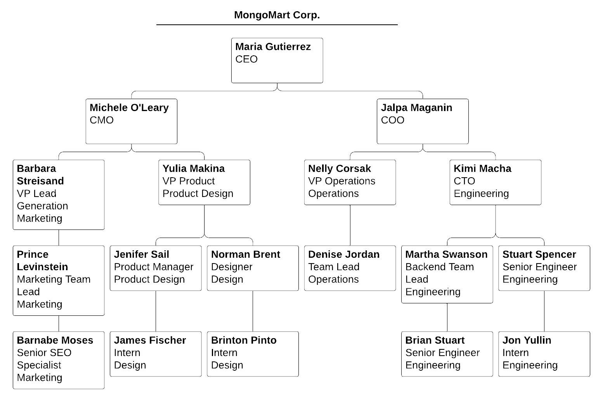
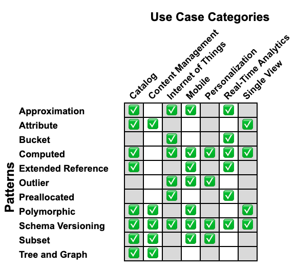

# Chapter 4: Patterns (Part 2)

## 4.1 Computed Pattern

### Quiz

Which one of the following scenarios is best suited for the application of the Computed Pattern?

- [ ] We need to calculate a value that is displayed once per minute and is based on a field which updates 100 times per minute.
- [ ] We need to group documents and sum on a field.
- [ ] We have too much information to store in a single document.
- [ ] We need to calculate a value that is displayed 100 times a minute and is based on a field which updates 100 times per minute.
- [x] We need to calculate a value that is displayed 100 times a minute and is based on a field which updates once a minute.

***See detailed answer***
    
___Correct Options:___

- We need to calculate a value that is displayed 100 times a minute and is based on a field which updates once a minute.

In this case, performing the aggregation once per minute and storing the result saves computations that would have been performed with each read operation, generating many unnecessary operations.

___Incorrect Options:___

- We need to group documents and sum on a field.

Situations where data transformations are being used are central to choosing to implement the Computed Pattern. However, just performing data transformation does not necessitate the use of the Computed Pattern. Rather, recognizing that a value should be cached instead of transformed is a better indicator that we should be using this pattern

- We have too much information to store in a single document.

Look at either the Subset Pattern or the Bucket Pattern to address this issue.

- We need to calculate a value that is displayed once per minute and is based on a field which updates 100 times per minute.

The Computed Pattern does not save any computation in this situation, rather it either leads to performing more calculations or to having stale data.

- We need to calculate a value that is displayed 100 times a minute and is based on a field which updates 100 times per minute.

You could benefit by using the Computed Pattern if you decide to do the computation less than 100 times per minute. This could be accomplished by using the Approximation Pattern.

## Lab: Apply the Computed Pattern

### Problem:

***User Story***

Our city is going green, and we're reassessing our power plant. A lot of residents are switching to solar panels for their source of electricity and the power plant needs to be both ecologically friendly and flexible in its distribution of electricity throughout the city.

A number of residents are on board with the Green New Deal and are promptly installing solar panels on their homes, which reduces the consumption of electricity from the power plant.

In some cases, the new solar homes produce more energy than they use, thus selling the excess energy back to the power plant.

Our database is tracking the following data about each building in the city: how much energy in kilowatts (kW) per hour it produces (if any), how much energy it consumes, and how much energy needs to be supplemented daily.

In order to make our plant more flexible in adapting to the growing number of solar-powered homes and to project out to the happy date when there won't be a need for a city power plant, our computer algorithms are analyzing consumption data by city zones one day at a time.

    {
      "_id": ObjectId("5c9414f25e6aff2b8870a2d0"),
      "address": {
        "building number": "742",
        "street name": "Evergreen Terrace",
        "city": "Springfield",
        "state": "MA",
        "zip code": "01111"
      },
      "owner": "Homer J. Simpson",
      "zone": 13,
      "date": ISODate("2019-03-21T23:03:31.197Z"),
      "kW per day": {
        "consumption": 10,
        "self-produced": 7,
        "city-supplemented": 3
      }
    }

The problem with this design is that we need to calculate zone totals from each building's report every day, which is a lot of unnecessary calculation during reads.

Every zone has anywhere from 100 to 900 buildings and we will create a zone collection using the consumption data that comes in from every unit in each zone daily.

---

***Task***

To address this issue, we've decided to implement the Computed Pattern. We will create a separate collection that stores zone-based summaries on zone consumption, production, and city-supplemented energy metrics, which we will calculate and overwrite whenever new data comes into the system.

To complete this lab:

- Modify the following schema to represent the schema we will store in our computed collection. Remove any fields we do not need to store in our computed collection:

    {
      "_id": "<objectId>",
      "address": {
        "building number": "<string>",
        "street name": "<string>",
        "city": "<string>",
        "state": "<string>",
        "zip code": "<string>"
      },
      "owner": "<string>",
      "zone": "<int>",
      "date": "<date>",
      "kW per day": {
        "consumption": "<int>",
        "self-produced": "<int>",
        "city-supplemented": "<int>"
      }
    }

- Save your modified schema to a file named pattern_computed.json.

- Validate your answer on Windows by running in the CMD shell:

    validate_m320 pattern_subset --file pattern_computed.json
 
- Validate your answer on MacOS and Linux by running:

    ./validate_m320 pattern_subset --file pattern_computed.json
 
After running this script you will either be given a validation code or an error message indicating what might be missing in your file.

When you get the validation code, paste it in the text box below and click submit.

***Enter answer here:***

    5c94f393f752ec6b191c3c7d
    
***See detailed answer***

To solve this problem, you had to use the Computed Pattern

Start by removing the unnecessary fields: city, owner, and address. These fields are irrelevant for our computations and useless for our AI.

We want to keep the rest of the fields, since they give us important information about energy consumption by zone, throughout time, which will help evaluate any fluctuations based on day of week, zone, weather, season, etc.

The document listed in the question would look like the following once transformed:

    {
      "_id": ObjectId("5c9414f25e6aff2b8870a2d0"),
      "zone": 13,
      "date": ISODate("2019-03-21T00:00:00.000Z"),
      "kW per day": {
        "consumption": 9756,
        "self-produced": 2059,
        "city-supplemented": 7700
      }
    }

And the corresponding schema that you verified with the validator would look like this:

    {
      "_id": "<objectId>",
      "zone": "<int>",
      "date": "<date>",
      "kW per day": {
        "consumption": "<int>",
        "self-produced": "<int>",
        "city-supplemented": "<int>"
      }
    }
    
## 4.2 Bucket Pattern

### Quiz

Which one of the following requirements in our system is the best candidate to use the Bucket Pattern?

- [x] Our system ingests thousands of log lines each day for each host it monitors.
- [ ] Our system must embed a one-to-many relationship in one of our models, however, some of the result documents would be too big.
- [ ] Our system performs sums and averages over all elements of certain arrays.
- [ ] Our system handles 1 million IOT devices.
- [ ] Our system ingests 10 million pieces of data per day from 1 million devices, with 20% coming from 10 devices.

***See detailed answer***
    
___Correct Options:___

- Our system ingests thousands of log lines each day for each host it monitors.

Trying to keep one document per host or one document per log line may not work very well. Keeping a group of log lines per host sounds like a good design, however, knowing the details about the use cases and queries will help to confirm that this is a good model.

___Incorrect Options:___

- Our system handles 1 million IOT devices.

This is not sufficient to say that we should be using this pattern. If the devices are not sending data on a regular basis that need to be grouped, then we would not need the pattern. For example, we may just have to keep track of the device, its configuration, and its state.

- Our system ingests 10 million pieces of data per day from 1 million devices, with 20% coming from 10 devices.

The issue seems more related to the fact that a minority of devices have different behavior than the majority of devices. Consider looking at the Outlier pattern before opting to use the Bucket Pattern in this situation.

- Our system must embed a one-to-many relationship in one of our models, however, some of the result documents would be too big.

There is not enough information to tell us how we could group the many side of the relationship into buckets. The most likely optimal action to take is to link the relationship instead of embedding it.

- Our system performs sums and averages over all elements of certain arrays.

It sounds like we should look into the Computed Pattern instead.

## Lab: Apply the Bucket Pattern

### Problem

In this lab, we will be applying the Bucket Pattern to address an IoT use case scenario.

___Scenario:___

You've been called in to help improve the performance profile of an application that provides a dashboard and reporting information of cell tower quality service metrics.

This application collects a set of metric information sent directly from cell towers.

Each cell tower emits a message similar to the following, in 1 minute intervals:

    {
      "date": "2019-05-01T17:23:43.042Z",
      "celltower_id": "BBA87930-4A72-4D77-B238-2BA5899C9BEC",
      "coordinates": [
        -8.5837984085083,
        41.161823159286136
      ],
      "established_calls": 50013,
      "dropped_calls": 1231,
      "data_in_gb": 142,
      "data_out_gb": 481
    }

The information sent in each message corresponds to:

- the current longitude and latitude of the cell tower - coordinates
- a unique identifier of the cell tower - celltower_id
- the date of the measurement - date
- the following accumulated counters, accumulated since last reboot:
    - the number of established cell phone calls - established_calls
    - the number of dropped cell phone calls - dropped_calls
    - the amount of inbound data traffic - data_in_gb
    - the amount of outbound data traffic - data_out_gb

This system needs to support the following operational requirements:

- Be capable of storing measurements for at least 500 cell towers
- Be able to produce cell tower cumulative reports on one or all four of the accumulated counters, with the following specifications:
    - Each of these reports consists of a plotted graph of the last 24 hours for each metric, with a granularity of 5 minutes
    - The 95 percentile request latency expected for this report is 100ms

___Current Implementation:___

The current implementation is to store documents that are very similar to the emitted messages, having all messages stored in a measurements collection:

    db.measurements.find({"cell_tower.id": "BBA87930-4A72-4D77-B238-2BA5899C9BEC"})
    {
      "_id": ObjectId("5cd3587395f8fbc3fab3092e"),
      "date_received": ISODate("2019-05-01T17:24:00.000Z"),
      "message_date": ISODate("2019-05-01T17:23:43.042Z"),
      "cell_tower": {
        "location": {
          "type": "Point",
          "coordinates": [
              -8.5837984085083,
               41.161823159286136
          ]
        },
        "id": "BBA87930-4A72-4D77-B238-2BA5899C9BEC"
      },
      "established_calls": 50013,
      "dropped_calls": 1231,
      "data_in_gb": 142,
      "data_out_gb": 481
    }
    ...
    
This implementation is expected to fill out the database servers disk space in one month and there is no budget left for hardware improvements in the next 12 months.

The current implementation is unable to produce the reports within the required 100ms.

___Your Solution:___

In order to resolve the issues that the current approach is facing, you need to come up with a schema design alternative that allows for:

- an increase in the number of IoT devices and associated workload growth
- all report generation to comply with the expected SLA of less than 100ms
- allow for the application to report status for the last 24 hours, with a granularity of 5 minutes

Using your pattern knowledge, consider the following three choices for the implementation:

___A:___ One document per hour:

    {
      "_id": ObjectId("5cd3587395f8fbc3fab3092e"),
      "date": ISODate("2019-05-01T17:00:00.000Z"),
      "celltower_id": "BBA87930-4A72-4D77-B238-2BA5899C9BEC",
      "established_calls": {
        "minutes": [
          98, 262, 266, 106, 254, 109, 3, 32, 257, 199,
          194, 209, 251, 269, 175, 42, 240, 169, 166, 149,
          238, 43, 128, 119, 120, 134, 267, 87, 228, 56,
          198, 9, 203, 281, 266, 91, 210, 55, 91, 118,
          203, 283, 74, 19, 222, 37, 18, 249, 149, 76,
          165, 29, 44, 94, 277, 253, 79, 100, 182, 127
        ],
        "sum": 9072
      },
      "dropped_calls": {
        "minutes": [
          0, 1, 0, 0, 1, 0, 0, 2, 0, 0,
          0, 1, 0, 0, 0, 0, 0, 0, 0, 0,
          0, 0, 0, 0, 1, 0, 0, 0, 0, 0,
          0, 0, 0, 0, 0, 0, 0, 0, 0, 0,
          0, 0, 0, 0, 0, 0, 0, 0, 0, 0,
          0, 0, 0, 0, 0, 0, 0, 0, 0, 0
        ],
        "sum": 6
      },
      "data_in_gb": {
        "minutes": [
          5, 12, 30, 0, 24, 12, 12, 5, 16, 5,
          4, 18, 6, 2, 13, 7, 11, 2, 8, 30, 25,
          7, 4, 27, 2, 30, 0, 17, 17, 5,
          9, 19, 10, 4, 13, 1, 4, 3, 3, 28,
          12, 8, 1, 21, 6, 4, 29, 23, 3, 16,
          0, 30, 20, 17, 2, 13, 15, 12, 16, 6
        ],
        "sum": 704
      },
      "data_out_gb": {
        "minutes":[
          43, 100, 59, 40, 7, 57, 61, 3, 94, 84, 37,
          67, 25, 80, 40, 34, 8, 20, 69, 66,
          94, 71, 85, 95, 54, 65, 35, 26, 33,
          42, 19, 42, 72, 45, 100, 17, 96, 53, 50, 91,
          34, 79, 45, 34, 51, 96, 90, 5, 12, 30, 50,
          4, 67, 21, 54, 17, 6, 91, 19, 36
        ],
        "sum": 3020
      }
    }
    
___B:___ One document per day per metric:
         
    {
      "_id": ObjectId("5cd3587395f8fbc3fab30934"),
      "date": ISODate("2019-05-01"),
      "metric:": "established_calls",
      "celltower_id": "BBA87930-4A72-4D77-B238-2BA5899C9BEC",
      "measurements": {
        "0": [98, 262, 266, 106, 254, 109, 3, 32, 257, 199, ... ],
        "1": [0,0,0,0,0,0,0,0,0,0,0,0,0,0,0,0,0,0,0,0,0,0,0 ...],
        "2": [0,0,0,0,0,0,0,0,0,0,0,0,0,0,0,0,0,0,0,0,0,0,0 ...],
        ...
        "23": [0,0,0,0,0,0,0,0,0,0,0,0,0,0,0,0,0,0,0,0,0,0,0 ...],
      },
      "sum": 9072
    }
    {
      "_id": ObjectId("5cd3587395f8fbc3fab30933"),
      "date": ISODate("2019-05-01"),
      "metric:": "dropped_calls",
      "celltower_id": "BBA87930-4A72-4D77-B238-2BA5899C9BEC",
      "measurements": {
        "0": [ 0, 1, 0, 0, 1, 0, 0, 2, 0, 0, 0, 1, 0, 0, 0, ... ],
        "1": [0,0,0,0,0,0,0,0,0,0,0,0,0,0,0,0,0,0,0,0,0,0,0 ...],
        "2": [0,0,0,0,0,0,0,0,0,0,0,0,0,0,0,0,0,0,0,0,0,0,0 ...],
        ...
        "23": [0,0,0,0,0,0,0,0,0,0,0,0,0,0,0,0,0,0,0,0,0,0,0 ...]
    
      },
      "sum": 6
    }
    {
      "_id": ObjectId("5cd3587395f8fbc3fab30932"),
      "date": ISODate("2019-05-01"),
      "metric:": "data_in_gb",
      "celltower_id": "BBA87930-4A72-4D77-B238-2BA5899C9BEC",
      "measurements": {
        "0": [ 5, 12, 30, 0, 24, 12, 12, 5, 16, 5, 4, 18, 6 ...],
        "1": [0,0,0,0,0,0,0,0,0,0,0,0,0,0,0,0,0,0,0,0,0,0,0 ...],
        "2": [0,0,0,0,0,0,0,0,0,0,0,0,0,0,0,0,0,0,0,0,0,0,0 ...],
        ...
        "23": [0,0,0,0,0,0,0,0,0,0,0,0,0,0,0,0,0,0,0,0,0,0,0 ...],
      },
      "sum": 704
    }
    {
      "_id": ObjectId("5cd3587395f8fbc3fab30931"),
      "date": ISODate("2019-05-01"),
      "metric:": "data_out_gb",
      "celltower_id": "BBA87930-4A72-4D77-B238-2BA5899C9BEC",
      "measurements": {
        "0":[ 43, 100, 59, 40, 7, 57, 61, 3, 94, 84, 37, 67 ... ],
        "1": [0,0,0,0,0,0,0,0,0,0,0,0,0,0,0,0,0,0,0,0,0,0,0 ...],
        "2": [0,0,0,0,0,0,0,0,0,0,0,0,0,0,0,0,0,0,0,0,0,0,0 ...],
        ...
        "23": [0,0,0,0,0,0,0,0,0,0,0,0,0,0,0,0,0,0,0,0,0,0,0 ...],
      },
      "sum": 3020
    }
    
___C:___ One document per day:

    {
      "_id": ObjectId("5cd3587395f8fbc3fab3092e"),
      "date": ISODate("2019-05-01"),
      "celltower_id": "BBA87930-4A72-4D77-B238-2BA5899C9BEC",
      "established_calls": {
        "0": 9072,
        "1": 0,
        "2": 0,
        ...
        "23": 0,
      },
      "dropped_calls": {
        "0": 6,
        "1": 0,
        "2": 0,
        ...
        "23": 0
      },
      "data_in_gb": {
        "0": 704,
        "1": 0,
        "2": 0,
        ...
        "23": 0,
      },
      "data_out_gb": {
        "0": 3020,
        "1": 0,
        "2": 0,
        ...
        "23": 0,
      }
    }

Which of the above solutions provide a valid approach for solving the problems experienced by the application?

- [x] A
- [x] B
- [ ] C

***See detailed answer***

___A___ and ___B___ are valid implementations. Both documents allow for a correct plotting of all the necessary information to process the reports, the response time for reporting generation and metric updates is both predictable and fast, keeping a steady data growth.

Option ___C___ is the most space- and write-efficient. However it is not viable because it does not allow for the specified reporting granularity of 5 minutes.

## 4.3 Schema Versioning Pattern

### Quiz

Which one of the following scenarios is the best candidate for the use of the Schema Versioning Pattern?

- [x] I want to avoid downtime when upgrading my schema.
- [ ] I can schedule a window of downtime long enough to migrate the documents to the new version.
- [ ] I want to keep track of the changes to my documents.
- [ ] I have billions of documents.
- [ ] I have many obsolete documents.

***See detailed answer***

___Correct Option:___

- I want to avoid downtime when upgrading my schema.

The above is the correct answer.

___Incorrect Options:___

- I can schedule a window of downtime long enough to migrate the documents to the new version.

In this situation, you may not want to do any extra work of having an app that handles many document versions or scheduling a migration over many days. In this situation, you don't have to use the Schema Versioning Pattern.

- I want to keep track of the changes to my documents.

The "Document Versioning Pattern" is a better choice for this requirement.

- I have billions of documents.

Having billions of documents is not a reason by itself. However, since you are likely going to change your schema, the Schema Versioning Pattern will be handy at that time.

- I have many obsolete documents.

The Schema Versioning Pattern does not help you with the management of obsolete documents. Though, it helps in reducing the cost of migrating them. For a solution more appropriate for managing obsolete documents, look into "zone sharding" in the MongoDB documentation.

[+ Info Zone Sharding](https://docs.mongodb.com/manual/core/zone-sharding/)

## Lab: Apply the Schema Versioning Pattern

### Problem

Which of the following scenarios are best suited for applying the Schema Versioning Pattern?

___Scenario A:___

Your team was assigned to upgrade the current schema with additional fields and transforming the type of different fields without bringing the system down for this upgrade. However, all documents need to be updated to the new shape quickly.

___Scenario B:___

The performance of your application became suboptimal over time. Your team has identified that the most commonly used collection could profit from embedding additional information from other collections using the Subset and Computed Patterns. All documents in the commonly-used collection will need to undergo this modification. If possible, you would like the transition to be done without downtime.

___Scenario C:___

Your company was bought by its slightly more successful competitor. Thankfully both your and your new owner's applications are flexible enough to handle both document shapes well. You do not have to modify the application or your document shape, but due to the merger, you have to keep documents with different structures in the same collection.

***Check all answers that apply:***

- [x] Scenario A
- [x] Scenario B
- [ ] Scenario C

***See detailed answer***

___Correct Option:___

Scenario A & B both describe situations for which the schema versioning pattern is designed.

- Scenario A

Since your team has a strict zero downtime transition requirement, it is essential to minimize the volume of writes throughout the upgrade. As a result, applying the Schema Versioning Pattern is the right solution.

- Scenario B

Even though the modifications to the schema are significant, it is likely that you can implement them without downtime using the Schema Versioning Pattern. Having additional information in the updated documents will probably translate to a new function that will make fewer requests to the database to gather what it needs. For the documents that were migrated, the application will call this new function. For the unmigrated documents, your application can still call the old function.

___Incorrect Option:___

- Scenario C

Since both applications can handle both schemas, there is no need to use the schema versioning pattern. However, there is still a need to somehow distinguish one document shape from another. In this case, applying the Polymorphic Pattern, which will be covered later is the more appropriate approach.

Once you decide to come up with a new schema that could be common to both current schemas, then you can use the schema versioning pattern to make the transition.

## 4.4 Tree Patterns

### Quiz

Which of the following scenarios would be ideal to use the Tree Pattern?

- [x] Company organization charts
- [ ] Contact lists of users
- [x] Product categories

***See detailed answer***

___Correct Options:___

- Tree patterns apply to hierarchical data structures which, for example, can represent:

Company org charts

- Product categories

which are the correct options.

___Incorrect Option:___

- Contact lists of users

This is generally not represented in an hierarchical structure, therefore it is not ideal to use a Tree Pattern in this use case.

[+ Info Tree Pattern](https://docs.mongodb.com/manual/applications/data-models-tree-structures/)

## Lab: Tree Patterns

### Problem

In this lab, you will be selecting a variant of the Tree Pattern to improve the performance of a common set of operations for a given application.

___Scenario:___

Given your expertise in schema design, you have been called in to help improve the performance of a human resources management application called Success Factions.

This application needs to be able to map a corporate reporting structure, an organization chart, like the one this diagram represents:

Success Factions was originally designed by only taking into account the information of a single individual's data in the organization chart. Therefore, documents in the employees collection, where this data is stored, has the following schema:

    {
      "_id": "<objectId>",
      "name": "<string>",
      "role": "<string>",
      "department": {
        "name": "<string>",
        "id": "<objectId>"
      }
    }

___Task:___

You have been tasked to improve the schema design of the employees collection to better support the following set of operations:

- Issue one database request to find the direct manager of a given employee.
- Collect all direct reports of an employee with one single and efficient query.
- Issue one update operation to change the reporting structure of an employee.

Which of the following document notation examples and tree patterns implement all of these pieces of functionality?

- [ ] Materialized Paths

        {
          "_id": "<objectId>",
          "name": "<string>",
          "role": "<string>",
          "department": {
            "name": "<string>",
            "id": "<objectId>"
          },
          "reports_to": "<string>/<string>/<string>"
        }

- [ ] Child References
     
        {
          "_id": "<objectId>",
          "name": "<string>",
          "role": "<string>",
          "department": {
            "name": "<string>",
            "id": "<objectId>"
          },
          "reports": [
            { "id": "<objectId>", "name": "<string>" }
          ]
        }
        

- [x] Parent References

        {
          "_id": "<objectId>",
          "name": "<string>",
          "role": "<string>",
          "department": {
            "name": "<string>",
            "id": "<objectId>"
          },
          "reports_to": {
            "id": "<objectId>",
            "name": "<string>"
          }
        }

- [ ] Array of Ancestors

        {
          "_id": "<objectId>",
          "name": "<string>",
          "role": "<string>",
          "department": {
            "name": "<string>",
            "id": "<objectId>"
          },
          "reports_to": [
            { "id": "<objectId>", "name": "<string>" }
          ]
        }
        
***See detailed answer***
    
___Correct Option:___
    
- Parent References
    
        {
          "_id": "<objectId>",
          "name": "<string>",
          "role": "<string>",
          "department": {
            "name": "<string>",
            "id": "<objectId>"
          },
          "reports_to": { "id": "<objectId>", "name": "<string>" }
        }

Using the Parent References pattern would be most efficient and straightforward approach given the requirements.
    
Using as an example "Jon Yullin" and his manager "Stuart Spencer", we would get the following:
    
        {
          "_id": ObjectId("123414123"),
          "name": "Jon Yullin",
          "role": "Intern",
          "department": {
            "name": "Engineering",
            "id": ObjectId("988576342364")
          },
          "reports_to": { "id": ObjectId("123414123") , "name": "Stuart Spencer" },
        }

One single database request to find the direct manager of a given employee
    
        > db.employees.find({"name": "Jon Yullin"})
        {
          "_id": ObjectId("123414123"),
          "name": "Jon Yullin",
          "role": "Intern",
          "department": {
            "name": "Engineering",
            "id": ObjectId("988576342364")
          },
          "reports_to": { "id": ObjectId("123414124") , "name": "Stuart Spencer" }
        }

In this schema, the reports_to field gives the application the direct manager information.
    
Collect all direct reports of an employee with one single and efficient query
    
        > db.employees.createIndex({"reports_to.name": 1})
        > db.employees.find({"reports_to.name": "Stuart Spencer"})
        {
          "_id": ObjectId("123414123"),
          "name": "Jon Yullin",
          "role": "Intern",
          "department": {
            "name": "Engineering",
            "id": ObjectId("988576342364")
          },
          "reports_to": { "id": ObjectId("123414124") , "name": "Stuart Spencer" }
        }

In this example, querying all of our employees for anyone with the value of "Stuart Spencer" for the name of their manager, reports_to.name will give us a list of all direct reports. Creating a single field index on reports_to.name makes this query efficient.
    
One single update operation to change the reporting structure of an employee
    
        > db.employees.updateOne(
          {"name": "Jon Yullin"},
          {"$set": {"reports_to": { "id":  ObjectId("123414122"), "name": "Jalpa Maganin" }}}
        )
        {
          "_id": ObjectId("123414123"),
          "name": "Jon Yullin",
          "role": "Intern",
          "department": {
            "name": "Engineering",
            "id": ObjectId("988576342364")
          },
          "reports_to": { "id":  ObjectId("123414122"), "name": "Jalpa Maganin" }
        }

Or in the case we would like replace a manager to a set of direct
    
___Incorrect Options:___
    
- Array of Ancestors
    
        {
          "_id": "<objectId>",
          "name": "<string>",
          "role": "<string>",
          "department": {
            "name": "<string>",
            "id": "<objectId>"
          },
          "reports_to": [ { "id": "<objectId>", "name": "<string>" } ]
        }

Array of Ancestors is a pattern that allows us to perform all of the requested queries in an efficient way, however the update operation would not be possible with a single update operation.
    
One single update operation to change the reporting structure of an employee
    
To exemplify this scenario let's promote "Stuart Spencer" and have him report to "Jalpa Maganin"
    
The reports_to field in "Stuart Spencer" document could be performed with a single update:
    
        > var new_reporting_structure = [
          { "id": ObjectId("123414120") , "name": "Maria Gutierrez" },
          { "id": ObjectId("123414123") , "name": "Jalpa Maganin" }
          ]
        > db.employees.updateOne(
            {"name": "Stuart Spencer"},
            {"$set": {"reports_to": new_reporting_structure, "role": "Manager"}}
          )
        {
          "_id": ObjectId("123414123"),
          "name": "Stuart Spencer",
          "role": "Manager",
          "department": {
            "name": "Engineering",
            "id": ObjectId("988576342364")
          },
          "reports_to": [
            { "id": ObjectId("123414120") , "name": "Maria Gutierrez" },
            { "id": ObjectId("123414123") , "name": "Jalpa Maganin" },
          ]
        }

However, we would also need to run several updates, to reflect this new structure, on all of "Stuart Spencer" subsequent reports, which requires at least one other update.
    
That said, the Array of Ancestors is often the right solution when you need to find all direct and indirect reports.
    
- Materialized Paths
    
        {
          "_id": "<objectId>",
          "name": "<string>",
          "role": "<string>",
          "department": {
            "name": "<string>",
            "id": "<objectId>"
          },
          "reports_to": "<string>/<string>/<string>"
        }

Using "Jon Yullin" example we would get:
    
        {
          "_id": ObjectId("123414123"),
          "name": "Jon Yullin",
          "role": "Intern",
          "department": {
            "name": "Engineering",
            "id": ObjectId("988576342364")
          },
          "reports_to": "Maria Gutierrez/Jalpa Maganin/Kimi Macha/Stuart Spencer" }
        }

The Materialized Paths approach falls short on:
    
Collect all direct reports of an employee with one single and efficient query
    
We can use a regular expression to match all reports of a given employee. However, this regular expression query, to be efficient and use a supporting index, requires the prepending of left end side of the reports_to values. In this particular case, if we do not have the information of the root of the organization chart, the CEO name, we would not be able to create an efficient query.
    
        db.employees.createIndex({"reports_to": 1})
        // does not use the index on `reports_to`
        db.employees.find({"reports_to": /Stuart\ Spencer/)
        // can use the index on `reports_to` field
        db.employees.find({"reports_to": /^Maria\ Gutierrez.*Stuart\ Spencer/)
        
## 4.5 Polymorphic Pattern

### Quiz

Which one of the following scenarios is best suited for the use of the Polymorphic Pattern?

- [x] The organization acquired different companies over the years, serving the same markets with the same customers and there is a requirement to merge all systems into one.
- [ ] There is a requirement to keep many versions of a document, and these versions may have different fields for each version.
- [ ] The application has a base class with some derived classes.
- [ ] There are billions of documents.
- [ ] There is a requirement to store addresses for my customers.

***See detailed answer***

___Correct Option:___

- The organization acquired different companies over the years, serving the same markets with the same customers and there is a requirement to merge all systems into one.

The above is the correct answer. It is the single view use case we described in the lesson. The databases from the different acquired companies are likely similar and the polymorphic pattern applies very well in this situation.

___Incorrect Options:___

- There is a requirement to keep many versions of a document, and these versions may have different fields for each version.

The Document Versioning Pattern is a better fit for this requirement. This pattern utilizes the polymorphic aspect of the document. However, we suggest a different implementation for this pattern, using two collections to store the different versions of the documents.

- The application has a base class with some derived classes.

This requirement may lead to using the polymorphic pattern. However, there are some other requirements to meet. For example, do different objects need to be queried together? Since we do not have enough information, this option is incorrect.

- There are billions of documents.

This is not enough to dictate the use of any pattern.

- There is a requirement to store addresses for my customers.

If the customers have addresses in different parts of the world, then this pattern would be helpful. However, this has to be a specific requirement, and since it is not mentioned in this case, then this option is incorrect.

## Lab: Apply the Polymorphic Pattern

### Problem

___User Story___

Our recruiting agency has just picked up a big international client named Techsy. They want us to take over their recruitment infrastructure for the foreseeable future. Techsy has various community outreach and diversity initiative programs that are focused on recruiting which have to be incorporated into our existing system.

Before working with Techsy, most of our recruiting documents looked like this:

    {
      "_id": ObjectId("5caa9e799c0aa5e39686f803"),
      "first_name": "Arya",
      "last_name": "Stark",
      "engineer_level": 3,
      "education": [{
        "level": "BS",
        "subject": "Computer Science"
      }],
      "years_experience": 3,
      "previous_employer": "Hooli",
      "technical": ["C++", "Python", "Java", "Golang", "MongoDB", "MySQL", "Bash/Shell"],
      "non-technical": {
        "languages": ["English"],
        "other": ["fencing", "dance", "horseback riding", "management"]
      },
      "candidate_notes": "A fierce warrior and survivor. Will do amazingly on any team."
    }

The following two documents are additional types of documents we are now getting from the Techsy team:

    [{
      "_id": ObjectId("5caa9e819c0aa5e39686f804"),
      "first_name": "Ginevra",
      "last_name": "Weasley",
      "program_affiliation": "Veteran Outreach Apprenticeship",
      "team_placement": "Server",
      "start_date": ISODate("2017-01-31T00:00:00.000Z"),
      "end_date": ISODate("2018-01-31T00:00:00.000Z"),
      "education": "App Bootcamp",
      "extend_offer": "yes",
      "technical_skills": ["JS", "ReactJS", "NodeJS", "bash/shell", "HTML5", "CSS", "Ruby on Rails", "Python"],
      "non-technical_skills": {
        "languages": ["English"],
        "other": ["Magic"]
      },
      "notes": "Ginny has been an amazing part of the team during the apprenticeship and we would love to extend her an offer to join us more permanently."
    }, {
      "_id": ObjectId("5caa9e899c0aa5e39686f805"),
      "name": {
        "first": "Rincewind",
        "last": "TheWizzard"
      },
      "program_affiliation": "Techsy Summer Internship ",
      "team_placement": "Data Optimization",
      "start_date": ISODate("2019-06-01T00:00:00.000Z"),
      "end_date": ISODate("2019-08-31T00:00:00.000Z"),
      "education": [{
          "level": "BA Major",
          "subject": "Philosophy"
        },
        {
          "level": "BS Minor",
          "subject": "Artificial Intelligence"
        }
      ],
      "extend_offer": "yes",
      "skills": {
        "technical": ["R", "Django", "JavaScript", "Matlab", "HTML5", "CSS", "Mathematica", "LaTeX", "Java", "JIRA"],
        "languages": ["English", "Chimeran", "Vanglemesht", "Sumtri", "Black Oroogu", "High Borogravian", "beTrobi"],
        "other": []
      },
      "notes": "Rinecewind has great ideas, but he is a bit of a mess. We still like him a lot and would love to keep him on board."
    }]

Our recruiters need to be able to search all the candidates available in the system, meaning that we have to add the Techsy records into our candidates collection. After adding their records, we will need to be able to differentiate between the different document shapes.

---

___Task___

We've decided that the name format for all the varying document shapes can be structured as two separate fields: first_name and last_name. However, the rest of the differences are not that easy to consolidate.

To address this, we will use the Polymorphic Pattern to identify the shape of each document depending on which recruiting source it came from. We will make the following modifications to our current schemas:

- Across all documents, we will use two fields for name: first_name and last_name.
- Across all documents, we will use a field called recruiting_source as the indicative field for the document shape.
- In documents that already have an existing program_affiliation field, we will use the value of this field as the recruiting_source.
- In documents that don't have program_affiliation, we will add a new field called recruiting_source.
- All documents should indicate whether an offer was extended via the extend_offer field.

To complete this task, complete the following steps:

- Modify the following schemas to incorporate the previously-stated changes:
        
        [{
          "_id": "<objectId>",
          "first_name": "<string>",
          "last_name": "<string>",
          "engineer_level": "<int>",
          "education": [{
            "level": "<string>",
            "subject": "<string>"
          }],
          "years_experience": "<int>",
          "previous_employer": "<string>",
          "technical": ["<string>"],
          "non-technical": {
            "languages": ["<string>"],
            "other": ["<string>"]
          },
          "candidate_notes": "<string>"
        }, {
          "_id": "<objectId>",
          "first_name": "<string>",
          "last_name": "<string>",
          "program_affiliation": "<string>",
          "team_placement": "<string>",
          "start_date": "<date>",
          "end_date": "<date>",
          "education": "<string>",
          "extend_offer": "<string>",
          "technical_skills": ["<string>"],
          "non-technical_skills": {
            "languages": ["<string>"],
            "other": ["<string>"]
          },
          "notes": "<string>"
        }, {
          "_id": "<objectId>",
          "name": {
            "first": "<string>",
            "last": "<string>"
          },
          "program_affiliation": "<string>",
          "team_placement": "<string>",
          "start_date": "<date>",
          "end_date": "<date>",
          "education": [{
              "level": "<string>",
              "subject": "<string>"
            },
            {
              "level": "<string>",
              "subject": "<string>"
            }
          ],
          "extend_offer": "<string>",
          "skills": {
            "technical": ["<string>"],
            "languages": ["<string>"],
            "other": ["<string>"]
          },
          "notes": "<string>"
        }]

- Save the updated schemas to a file named pattern_polymorphic.json, with each schema definition separated by a comma and the full solution enclosed in array brackets.

- Validate your answer on Windows by running in the CMD shell:

    validate_m320 pattern_polymorphic --file pattern_polymorphic.json

- Validate your answer on MacOS and Linux by running:

    ./validate_m320 pattern_polymorphic --file pattern_polymorphic.json
 
After running this script, you will either be given a validation code or an error message indicating what might be missing in your file.

When you get the validation code, paste it in the text box below and click submit.

***Enter answer here:***

    5caab67a9c0aa5e39686f806
    
***See detailed answer***

To solve this problem, you had to use the Polymorphic Pattern

The recruiting_source field determines the shape of each document. We can rename the program_affiliation field to become the recruiting_source field in the second and third schema, and simply add that field to the first schema.

Since the program description specified that we were able to unify the name format for all the varying document shapes into two separate fields, first_name and last_name, we should reflect that change in the third schema.

All other fields present in each schema should remain as they are, since the recruiting_source is now communicating the shape of the document to our application.

The document listed in the question should look like the following once transformed:

    [{
      "_id": ObjectId("5caa9e799c0aa5e39686f803"),
      "first_name": "Arya",
      "last_name": "Stark",
      "recruiting_source": "Recruiting Agency",
      "years_experience": 3,
      "previous_employer": "Hooli",
      "extend_offer": "yes",
      "engineer_level": 3,
      "education": [{
        "level": "BS",
        "subject": "Computer Science"
      }],
      "technical": ["C++", "Python", "Java", "Golang", "MongoDB", "MySQL", "Bash/Shell"],
      "non-technical": {
        "languages": ["English"],
        "other": ["fencing", "dance", "horseback riding", "management"]
      },
      "candidate_notes": "A fierce warrior and survivor. Will do amazingly on any team."
    }, {
      "_id": ObjectId("5caa9e819c0aa5e39686f804"),
      "first_name": "Ginevra",
      "last_name": "Weasley",
      "recruiting_source": "Veteran Outreach Apprenticeship",
      "extend_offer": "yes",
      "team_placement": "Server",
      "start_date": ISODate("2017-01-31T00:00:00.000Z"),
      "end_date": ISODate("2018-01-31T00:00:00.000Z"),
      "education": "App Bootcamp",
      "technical_skills": ["JS", "ReactJS", "NodeJS", "bash/shell", "HTML5", "CSS", "Ruby on Rails", "Python"],
      "non-technical_skills": {
        "languages": ["English"],
        "other": ["Magic"]
      },
      "notes": "Ginny has been an amazing part of the team during the apprenticeship and we would love to extend her an offer to join us more permanently."
    }, {
      "_id": ObjectId("5caa9e899c0aa5e39686f805"),
      "first_name": "Rincewind",
      "last_name": "TheWizzard",
      "recruiting_source": "Techsy Summer Internship ",
      "extend_offer": "yes",
      "team_placement": "Data Optimization",
      "start_date": ISODate("2019-06-01T00:00:00.000Z"),
      "end_date": ISODate("2019-08-31T00:00:00.000Z"),
      "education": [{
          "level": "BA Major",
          "subject": "Philosophy"
        },
        {
          "level": "BS Minor",
          "subject": "Artificial Intelligence"
        }
      ],
      "skills": {
        "technical": ["R", "Django", "JavaScript", "Matlab", "HTML5", "CSS", "Mathematica", "LaTeX", "Java", "JIRA"],
        "languages": ["English", "Chimeran", "Vanglemesht", "Sumtri", "Black Oroogu", "High Borogravian", "beTrobi"],
        "other": []
      },
      "notes": "Rinecewind has great ideas, but he is a bit of a mess. We still like him a lot and would love to keep him on board."
    }]

And the corresponding schema that you verified with the validator would look like this:

    [{
      "_id": "<objectId>",
      "first_name": "<string>",
      "last_name": "<string>",
      "recruiting_source": "<string>",
      "years_experience": "<int>",
      "previous_employer": "<string>",
      "extend_offer": "<string>",
      "engineer_level": "<int>",
      "education": [{
        "level": "<string>",
        "subject": "<string>"
      }],
      "technical": ["<string>"],
      "non-technical": {
        "languages": ["<string>"],
        "other": ["<string>"]
      },
      "candidate_notes": "<string>"
    }, {
      "_id": "<objectId>",
      "first_name": "<string>",
      "last_name": "<string>",
      "recruiting_source": "<string>",
      "extend_offer": "<string>",
      "team_placement": "<string>",
      "start_date": "<date>",
      "end_date": "<date>",
      "education": "<string>",
      "technical_skills": ["<string>"],
      "non-technical_skills": {
        "languages": ["<string>"],
        "other": ["<string>"]
      },
      "notes": "<string>"
    },
    {
      "_id": "<objectId>",
      "first_name": "<string>",
      "last_name": "<string>",
      "recruiting_source": "<string>",
      "extend_offer": "<string>",
      "team_placement": "<string>",
      "start_date": "<date>",
      "end_date": "<date>",
      "education": [{
          "level": "<string>",
          "subject": "<string>"
        },
        {
          "level": "<string>",
          "subject": "<string>"
        }
      ],
      "skills": {
        "technical": ["<string>"],
        "languages": ["<string>"],
        "other": ["<string>"]
      },
      "notes": "<string>"
    }
    ]

## 4.6 Other Patterns

### Quiz

A pharmaceutical company needs to implement a design to model the relationships between the company and its partners, customers, and suppliers. A team came up with a design that works perfectly, meeting all performance requirements. However, when loading the real data in the system, they realized that one customer, the U.S. government had too many contacts to be stored into the designated array for this information.

Instead of redesigning the whole system to make this customer fit well into the new data model, which pattern can you use?

- [ ] The Schema Versioning Pattern.
- [ ] The Pharmaceutical Pattern.
- [ ] The Subset Pattern.
- [x] The Outlier Pattern.
- [ ] The Attribute Pattern.

***See detailed answer***

___Correct Option:___

- The Outlier Pattern

In this use case, an alternative to redesigning the whole system and maybe not meeting the performance requirements already achieved, could be to use the Outlier Pattern. The list of contacts can be split into many documents once it surpasses a certain size. Also, the application may want to have a different way to display the contacts by grouping them into many pages for larger sets of contacts.

### 4.7 Summary of Patterns

